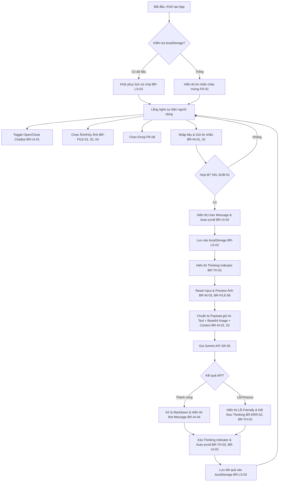

# Coding Plan for app.js

Dựa trên các tài liệu `Business Rules (BR)`, `System Requirements (SR)` và `Use Case (UC)`, đề xuất sơ đồ khối logic lập kế hoạch code cho app.js. Sơ đồ này tuân thủ nguyên tắc tách biệt giữa giao diện (UI) và tầng xử lý dịch vụ (Service layer).

## I. Sơ đồ khối logic xử lý trong app.js

## II.Các Module cần lập kế hoạch trong app.js

Dựa vào các tài liệu, bạn có thể chia app.js thành các phần chức năng sau:
### 1. Quản lý Trạng thái (State Management):
- Lưu trữ danh sách tin nhắn (chatHistory).
- Lưu trữ dữ liệu ảnh hiện tại (Base64, mimeType).
- Trạng thái đóng/mở của chatbot.
### 2. Khởi tạo & Khôi phục (Initialization):
- Đọc dữ liệu từ localStorage với key `chatHistory`.
- Nếu dữ liệu lỗi, tiến hành xóa bộ nhớ để bắt đầu phiên mới.
- Render lại lịch sử lên UI khi load trang.
### 3. Xử lý Sự kiện UI (Event Handlers):
- Textarea: Tự động tăng chiều cao khi nhập liệu (FR-05) và xử lý phím Enter để gửi, Shift+Enter để xuống dòng.
- Attachment: Kiểm tra định dạng (PNG, JPG, WebP) và dung lượng ảnh (≤ 5MB) trước khi hiển thị preview.
- Emoji Picker: Chèn emoji vào đúng vị trí con trỏ trong textarea.
### 4. Xử lý Logic Gửi/Nhận (Core Logic):
- Validation: Đảm bảo không gửi tin nhắn rỗng trừ khi có đính kèm ảnh.
- AI Service: Hàm gọi Gemini API (Sử dụng model gemini-2.0-flash hoặc tương đương) với phương thức POST.
- Payload: Đóng gói dữ liệu gồm text và inlineData (cho ảnh) theo đúng thứ tự ưu tiên.
- Thinking Indicator: Tạo một bubble tạm thời và phải đảm bảo nó bị thay thế hoặc xóa bỏ khi có kết quả hoặc lỗi để tránh "kẹt thinking".
### 5. Xử lý Lỗi & Định dạng (Error & Format Handling):
- Bắt các lỗi như: Mất mạng, quá hạn mức (quota), lỗi API.
- Làm sạch định dạng Markdown (ví dụ: chuyển bold thành thẻ HTML tương ứng) từ phản hồi của AI.

## Lưu ý quan trọng từ tài liệu:
- Phải đảm bảo mỗi yêu cầu gửi đi chỉ tạo ra đúng một bubble phản hồi của bot.
- Không lưu thông tin nhạy cảm như API Key vào localStorage.
- Luôn tự động cuộn xuống cuối (auto-scroll) sau khi có tin nhắn mới.